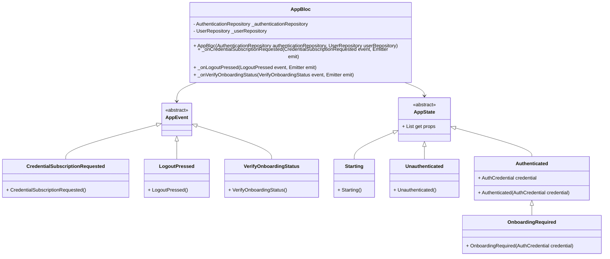

# Class Diagrams for App Bloc

This document provides an overview of the classes in the `app/bloc` directory, along with their relationships, represented as class diagrams using Mermaid syntax.

## Class Diagram

## Description

### AppBloc
The `AppBloc` class is the main Bloc for managing the application's state. It listens to events and updates the state accordingly. The key events handled by `AppBloc` include:
- `CredentialSubscriptionRequested`: Subscribes to the authentication repository's credential stream.
- `LogoutPressed`: Handles user logout.
- `VerifyOnboardingStatus`: Verifies the onboarding status of the current user.

### AppEvent
`AppEvent` is the base class for all events in the `AppBloc`. Specific events extend this class to handle different actions within the application.

### AppState
`AppState` is the base class for all states in the `AppBloc`. Specific states extend this class to represent different stages of the application's lifecycle. Examples include:
- `Starting`: Represents the initial state of the application.
- `Unauthenticated`: Represents the state when the user is not authenticated.
- `Authenticated`: Represents the state when the user is authenticated. This state is further extended by `OnboardingRequired` to indicate that the user requires onboarding.

### Relationships
- `AppBloc` depends on `AppEvent` and `AppState` to manage the application's state.
- `AppEvent` is extended by specific events like `CredentialSubscriptionRequested`, `LogoutPressed`, and `VerifyOnboardingStatus`.
- `AppState` is extended by specific states like `Starting`, `Unauthenticated`, and `Authenticated`. The `Authenticated` state is further extended by `OnboardingRequired`.