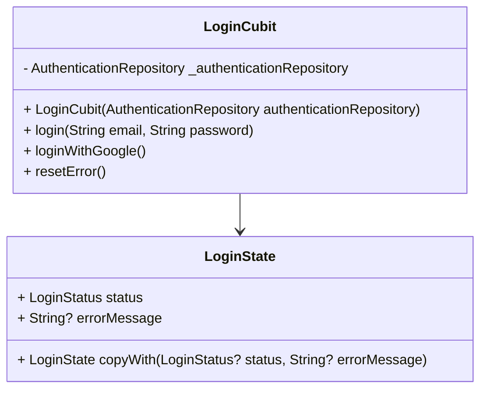

# Login Cubit Documentation

This document provides an overview of the `LoginCubit` and its associated state management for the login feature.

## Class Diagram

## Description

### LoginCubit
The `LoginCubit` is responsible for managing the state of the login process. It interacts with the `AuthenticationRepository` to handle user authentication. The cubit provides methods for logging in with email and password, logging in with Google, and resetting errors.

#### Methods
- `login(String email, String password)`: Initiates the login process using the provided email and password. Emits a loading state, followed by either a success or failure state.
- `loginWithGoogle()`: Initiates the login process using Google authentication. Emits a loading state, followed by either a success or failure state.
- `resetError()`: Resets the error state to its initial value.

### LoginState
The `LoginState` class represents the state of the login process. It includes the following properties:
- `status`: An enum representing the current status of the login process (`initial`, `loading`, `success`, or `failure`).
- `errorMessage`: An optional string containing an error message if the login process fails.

The `copyWith` method allows for creating a new instance of `LoginState` with updated properties while preserving the existing ones.
