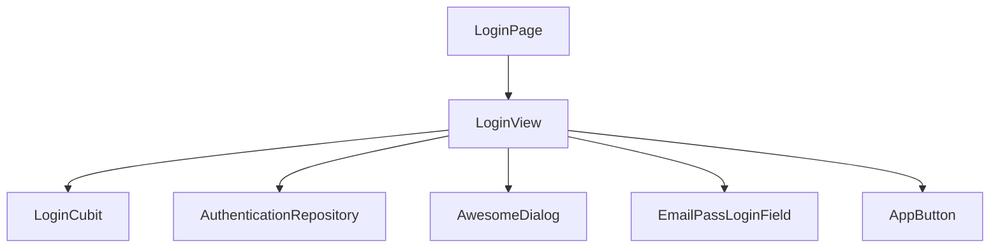
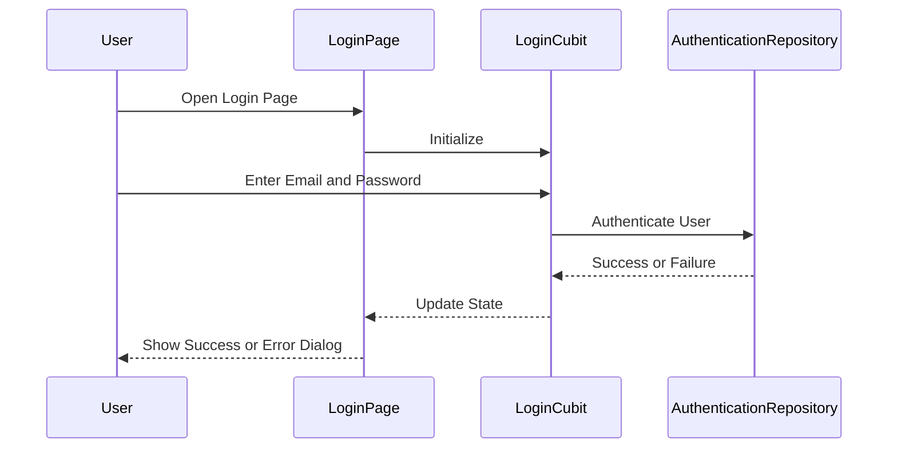
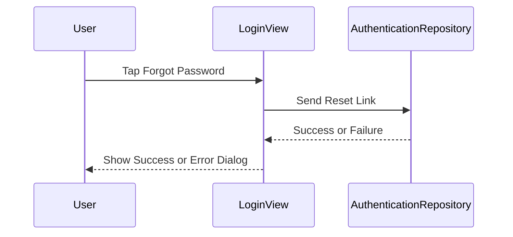

# Login View Documentation

This document provides an overview of the `LoginPage` and its associated components for the login feature.

## Component Diagram

## View Details

### LoginPage
The `LoginPage` serves as the entry point for the login feature. It initializes the `LoginCubit` and provides it to the widget tree. This page is responsible for managing the state of the login process and handling user interactions.

### LoginView
The `LoginView` is a stateful widget that contains the UI for the login feature. It includes the following components:
- **EmailPassLoginField**: Used for creating and validating the Email Login Form
- **AppButton**: Custom buttons for user actions, such as signing in and resetting the password.
- **AwesomeDialog**: An external flutter package used for displaying dialogs, such as error messages and password reset confirmations. (Source Package: [awesome_dialog](https://pub.dev/packages/awesome_dialog))

#### Sequence Diagram

### Forgot Password Flow
The `LoginView` also includes a forgot password feature. When the user taps the "Forgot Password" button, a dialog is displayed where the user can enter their email address. Upon submission, the app sends a password reset link to the provided email address.

#### Sequence Diagram

