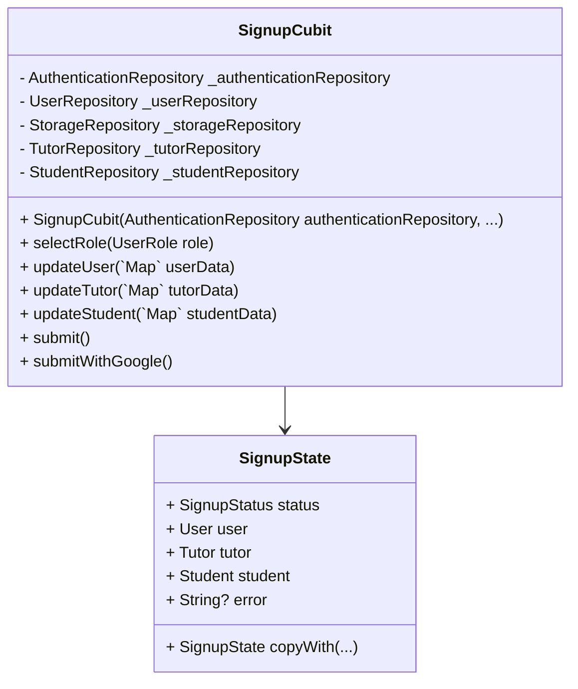

# State Machine of Signup Feature

The signup process is orchestrated by `SignupCubit`, which handles form data collection incrementally and delegates persistence to domain repositories (`AuthenticationRepository`, `UserRepository`, `TutorRepository`, `StudentRepository`, `StorageRepository`). Each domain model (`User`, `Tutor`, `Student`) is stored and updated immutably in the state, leveraging `copyWith` for safe state transitions.




### SignupState

`SignupState` represents the current signup workflow state:
- **status**: `initial` | `loading` | `success` | `failure`
- **user**: Partial or complete `User` model
- **tutor**: Partial or complete `Tutor` model
- **student**: Partial or complete `Student` model
- **error**: Optional error message on failure

States are immutable; use `copyWith` to create new instances with updated fields.

### SignupCubit

`SignupCubit` manages interaction between UI and repositories, emitting new `SignupState` instances as the user progresses through signup.

#### Methods

- **selectRole(UserRole role)**
  Sets the selected user role (`tutor` or `student`) in state, allowing the UI to render appropriate form fields.

- **updateUser(`Map<String, dynamic>` userData)**
  Merges incoming `userData` into the existing `User` model via `copyWith`, updating form state without side effects.

- **updateTutor(`Map<String, dynamic>` tutorData)**
  Merges `tutorData` into the `Tutor` model via `copyWith`, updating tutor-specific fields.

- **updateStudent(`Map<String, dynamic>` studentData)**
  Merges `studentData` into the `Student` model via `copyWith`, updating student-specific fields.

- **submit()**
  Executes the full signup flow:
  1. Emit `loading` status.
  2. Call `authenticationRepository.signUp(...)` to create auth credentials.
  3. Upload profile images via `storageRepository.upload...`.
  4. Create role-specific record (`Tutor` or `Student`) in its repository.
  5. Persist the final `User` model with `userRepository.create`.
  6. Emit `success` on completion or `failure` with `error` on exception.

- **submitWithGoogle()**
  Similar to `submit()`, but begins with `authenticationRepository.signInWithGoogle()`. Once credentials are obtained, follows the same sequence: image upload, model creation, and final user persistence.

We can relate the SignupState and SignupCubit methods using a state machine diagram, which illustrates the different ways a user can reach a specific state in the signup process.

##### State Machine Diagram of Signup Feature

```mermaid
stateDiagram-v2
    [*] --> Initial : Start
    Initial : SignupState.initial
    Initial --> SignupState : updateUser(data)
    Initial --> SignupState : selectRole(role)
    Initial --> SignupState  : updateTutor(data)
    Initial --> SignupState  : updateStudent(data)
    SignupState --> SignupState.copyWith(loading) : submit()
    SignupState --> SignupState.copyWith(loading) : submitWithGoogle()
    SignupState.copyWith(loading) --> SignupState.copyWith(success) : Success
    SignupState.copyWith(loading) --> SignupState.copyWith(failure) : Failure
    SignupState.copyWith(success) --> [*] : End
    SignupState.copyWith(failure) --> SignupState : 
```