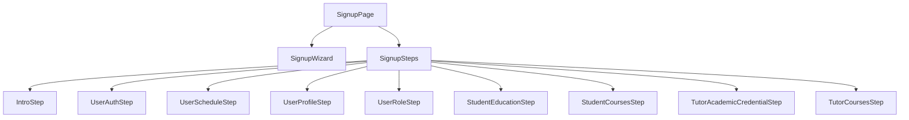
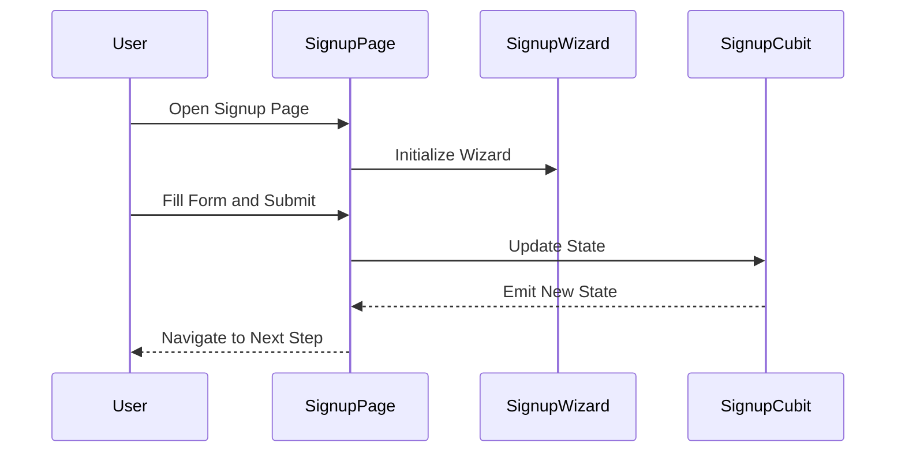

# Signup View Documentation

This document provides an overview of the `SignupPage` and its associated components for the signup feature.

## Component Diagram

## View Details

### SignupPage
The `SignupPage` serves as the entry point for the signup feature. It manages the overall flow of the signup process, including navigation between steps and form validation. The page uses the `SignupWizard` to display dialogues and animations, creating an engaging user experience.

### Signup Steps
The signup process is divided into multiple steps, each represented by a `SignupStep` object. These steps include:
- **IntroStep**: Introduces the user to the signup process.
- **UserAuthStep**: Collects authentication details, such as email and password.
- **UserScheduleStep**: Gathers the user's availability.
- **UserProfileStep**: Collects profile information, such as name and profile picture.
- **UserRoleStep**: Allows the user to select their role (e.g., tutor or student).
- **StudentEducationStep**: Collects educational details for students.
- **StudentCoursesStep**: Allows students to select their courses.
- **TutorAcademicCredentialStep**: Collects academic credentials for tutors.
- **TutorCoursesStep**: Allows tutors to select the courses they can teach.

### Sequence Diagram

#### Signup Flow

### General Structure
Each step in the signup process is defined by a `SignupStep` object, which includes:
- **Title**: The title of the step.
- **Dialogue**: The dialogue to be displayed during the step.
- **ShowIf**: A predicate function to determine if the step should be shown.
- **Builder**: A function to build the UI for the step.
- **Callback**: A function to handle the data submitted in the step.

This modular structure allows for easy customization and extension of the signup process.
