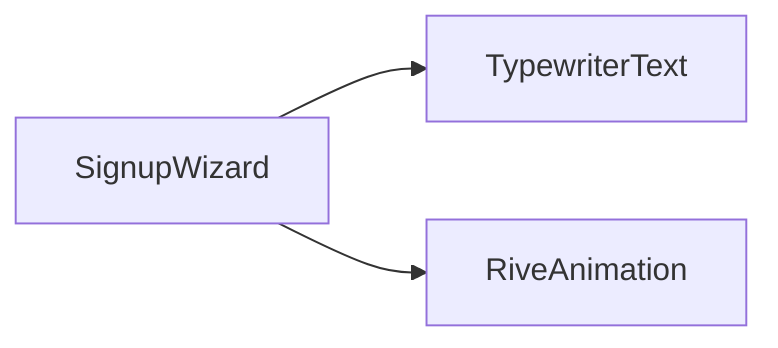
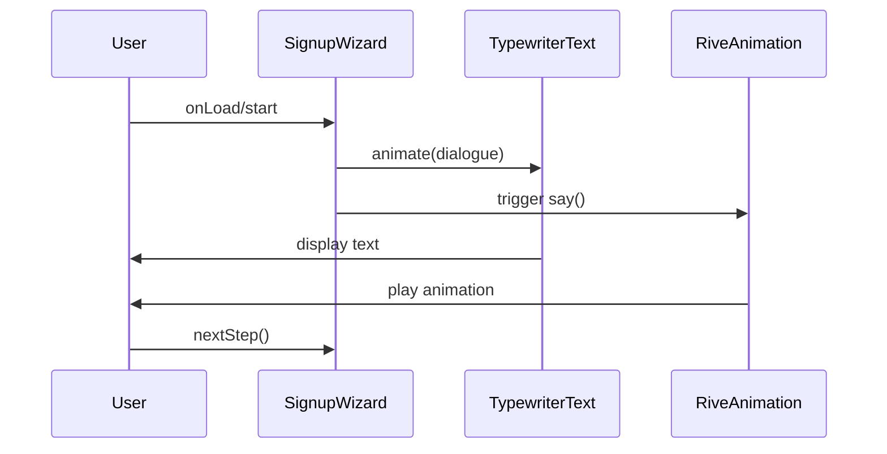
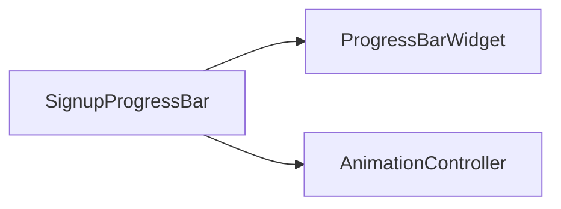
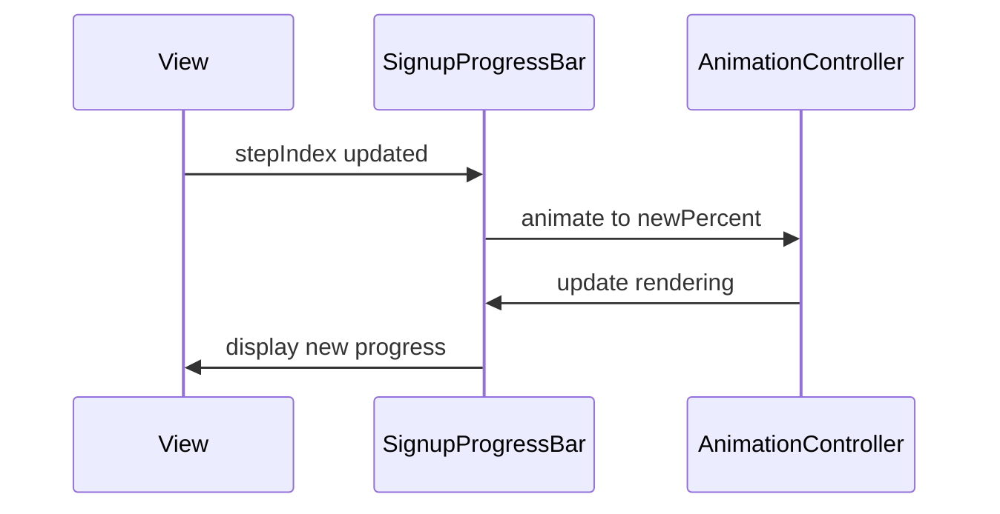
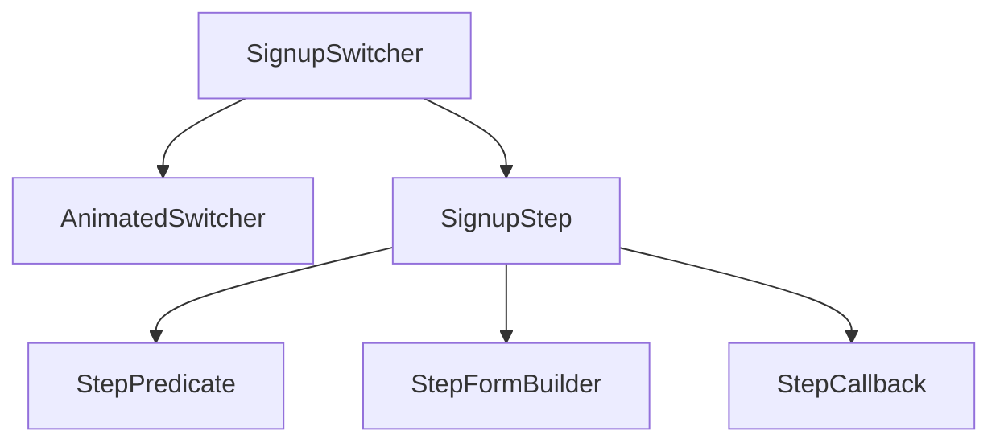
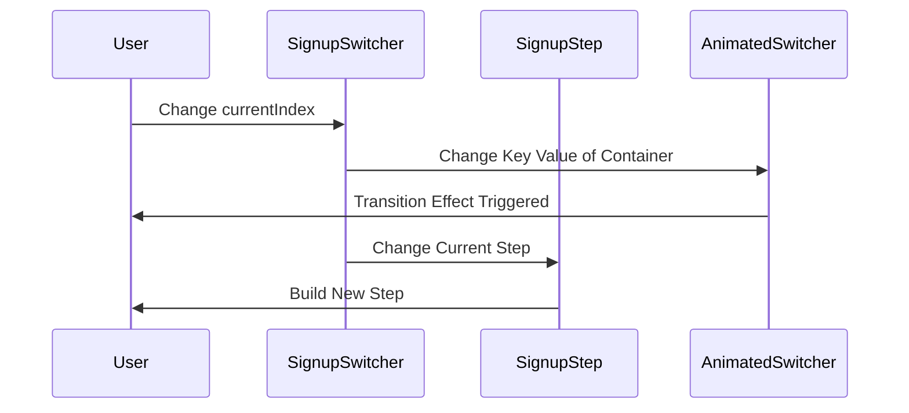
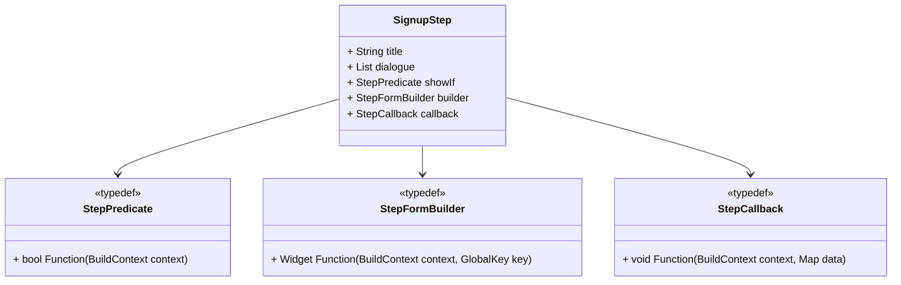

# Components of Signup Feature

This document provides an overview of the components (or widgets) used in the signup feature.  These widgets are modular components that enhance the user experience and simplify the implementation of the signup process.

## Widgets Overview

### SignupWizard 

The `SignupWizard` component guides the user through each signup step by animating a series of instructional messages with a typewriter effect. Simultaneously, a Rive animation (e.g., a book asset) plays when the `say()` method is invoked or when the widget loads. This conversational approach emulates the guided experience found in apps like Duolingo and can be extracted as a standalone package for use in other projects.

##### Component Diagram of SignupWizard



##### Sequence Diagram of SignupWizard



### SignupProgressBar

The `SignupProgressBar` visually represents the user's progress through the signup flow. It takes the total number of steps and the current step index as inputs, then animates the progress bar smoothly whenever the index changes, providing clear visual feedback to the user.

##### Component Diagram of SignProgressBar



##### Sequence Diagram of SignupProgressBar



### SignupSwitcher

The `SignupSwitcher` handles transitions between step widgets using Flutter's `AnimatedSwitcher`. By keying each container to the current step index, it detects changes and animates the transition from the old step to the new one. While page-based animations might simplify this, using `AnimatedSwitcher` gives precise control over entry and exit effects for each step.

##### Component Diagram of SignupSwitcher



##### Sequence Diagram when the SignupStep Changes.



## SignupStep

The `SignupStep` class represents a single step in the signup process, encapsulating title, dialogue, conditional display logic, UI building, and data handling.

##### Class Diagram of SignupStep



The `SignupStep` class contains the following properties:

##### 1. `String` title

Title is a string that represents the title of the step. Displayed in the AppBar, it provides a constant label for the current step as the animated dialogue changes.

##### 2. `List<String>` dialogue

The `dialogue` list contains the messages shown by `SignupWizard`. Each string is displayed with a typewriter animation to guide the user through the step.

##### 3. `StepPredicate` showIf

The `showIf` predicate determines whether the step should be shown, based on the current `BuildContext`. This allows conditional steps that adapt to user data or previous responses.

##### 4. `StepFormBuilder` builder

The `builder` function constructs the UI for this step, typically returning a form widget. It receives a `BuildContext` and a `GlobalKey<FormBuilderState>` so external controls (e.g., Next button) can trigger validation.

##### 5. `StepCallback` callback

After form validation, the `callback` is called with the `BuildContext` and a `Map<String, dynamic>` containing the user's input. This allows custom handling of the data, such as saving to a repository or updating application state.

## Putting It All Together

By combining `SignupWizard`, `SignupProgressBar`, `SignupSwitcher`, and `SignupStep`, you can build a complete, interactive signup flow:

```dart
SignupView(
  steps: [
    SignupStep(
      title: 'Create Account',
      dialogue: ['Welcome!', 'Let\'s create your account.'],
      showIf: (_) => true,
      builder: (context, key) => EmailForm(key: key),
      callback: (context, data) { /* save email */ },
    ),
    // add additional steps...
  ],
);
```

This setup handles animations, progress tracking, and data flow, offering a modular solution for onboarding experiences.